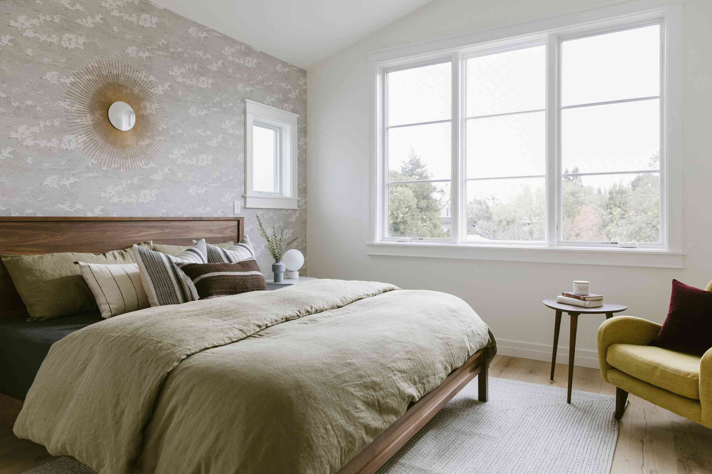
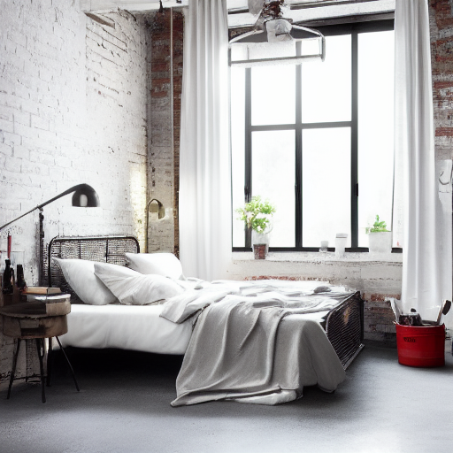
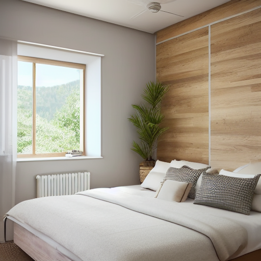

# RoomMorph AI

**Portfolio release: v0.1**

## Project Overview

RoomMorph AI is a local Gradio application for exploring interior-design ideas
with Stable Diffusion 1.5. It supports two workflows: redesigning an uploaded
room photograph with image-to-image generation and creating a new room concept
from text.

The project uses the repository's educational PyTorch implementation of CLIP,
VAE, U-Net diffusion, DDPM sampling, and classifier-free guidance under `sd/`.
It performs inference with pretrained weights; it does **not** train Stable
Diffusion from scratch or delegate generation to a third-party diffusion
pipeline.

## Practical Use Case

RoomMorph helps a user compare visual directions before investing in detailed
3D modeling or renovation planning. A user can upload an existing bedroom and
apply a style preset, or describe a new room from scratch and iterate with a
repeatable seed. The results are mood and concept references, not construction
documents or guarantees of exact geometry.

This v0.1 release is also an AI engineering portfolio project. It demonstrates
how a from-first-principles model implementation can be wrapped in a usable UI,
structured as a maintainable package, and operated conservatively on limited
hardware.

## Example Outputs

Only selected examples belong in `assets/examples/`. Ordinary runs remain under
the ignored `outputs/` directory.

### Redesign Existing Room

| Original room | Generated concept |
|:--:|:--:|
|  |  |

This early 512 x 512 image-to-image result is retained as a qualitative sample.
Its historical prompt, parameters, and timing were not recorded, so no benchmark
claim is attached to it. The visible structural changes also illustrate that
image-to-image guides the whole frame rather than preserving exact geometry.

### Generate New Room Concept



This 512 x 512 text-to-image result used 50 inference steps, CFG scale 8.0,
seed 42, and DDPM sampling. The full positive and negative prompts are recorded
in [`assets/examples/text-to-image/prompt.txt`](assets/examples/text-to-image/prompt.txt).

See [`assets/examples/README.md`](assets/examples/README.md) for curation and
measurement notes associated with the selected files.

## Features

- Two Gradio tabs with separate image-to-image and text-to-image callbacks.
- Japandi, Minimalist, Scandinavian, Industrial, Modern, and Cozy style presets.
- Positive and negative text prompts plus optional image redesign instructions.
- Explicit controls for resolution, inference steps, strength, CFG, and seed.
- PNG, JPG, JPEG, RGB, transparency, and EXIF-orientation handling.
- Automatic CUDA, Apple MPS, then CPU device selection.
- One lazy, process-wide tokenizer and model cache shared by both workflows.
- One-generation-at-a-time queueing to limit peak memory pressure.
- RGB Pillow output returned to Gradio and timestamped PNG persistence.
- Runtime, parameters, elapsed generation time, and saved filename metadata.
- Checkpoint-free smoke-test mode for development and CI.

The application does not include inpainting, ControlNet, authentication, a
database, payments, or an LLM.

## Architecture

### Inference Flows

```text
Uploaded room + style/instruction
             -> image preprocessing and square center crop
             -> VAE encoder and noisy latent
             -> CLIP-conditioned U-Net denoising with DDPM
             -> VAE decoder
             -> RGB image + metadata + outputs/roommorph_*.png

Style + positive/negative prompts
             -> random latent
             -> CLIP-conditioned U-Net denoising with DDPM
             -> VAE decoder
             -> RGB image + metadata + outputs/txt2img_*.png
```

### Package Boundaries

| Module | Responsibility |
|---|---|
| `app.py` | Gradio components, CSS, event input/output ordering, and queue setup |
| `roommorph/config.py` | Paths, environment flags, limits, and runtime devices |
| `roommorph/model_manager.py` | The single lazy tokenizer/model cache |
| `roommorph/prompts.py` | Style presets and effective prompt construction |
| `roommorph/image_utils.py` | Input preprocessing, RGB conversion, and output saving |
| `roommorph/generation.py` | Validation, metadata, inference locking, and both callbacks |
| `sd/` | Educational Stable Diffusion architecture, conversion, and DDPM pipeline |

Both callbacks call the same `model_manager.MODEL_STORE`. Model loading is
cached, while generation results are never cached. The inference lock and
Gradio queue both enforce concurrency one. Components are loaded on the CPU idle
device and moved to the selected runtime device only when needed.

## Repository Structure

```text
.
├── app.py
├── assets/
│   ├── README.md
│   └── examples/
│       ├── README.md
│       ├── image-to-image/
│       │   ├── industrial-bedroom-concept.png
│       │   └── original-bedroom.jpg
│       └── text-to-image/
│           ├── japandi-bedroom-concept.png
│           └── prompt.txt
├── data/                         # local tokenizer and weights, ignored
├── LICENSE
├── outputs/                      # ordinary generated images, ignored
├── requirements.txt
├── roommorph/
│   ├── config.py
│   ├── exceptions.py
│   ├── generation.py
│   ├── image_utils.py
│   ├── model_manager.py
│   └── prompts.py
└── sd/
    ├── attention.py
    ├── clip.py
    ├── ddpm.py
    ├── decoder.py
    ├── demo.ipynb
    ├── diffusion.py
    ├── encoder.py
    ├── model_converter.py
    ├── model_loader.py
    └── pipeline.py
```

## Local Setup

Python 3.10 or newer is recommended. From the repository root:

```bash
python -m venv .venv
source .venv/bin/activate
python -m pip install --upgrade pip
python -m pip install -r requirements.txt
```

Use the same Python interpreter for installation, Gradio, and the notebook.
`requirements.txt` intentionally lists direct runtime dependencies only:
PyTorch, NumPy, Pillow, Transformers, tqdm, Gradio, and PyTorch Lightning.
PyTorch Lightning is needed because deserializing the legacy checkpoint may
resolve classes from that package.

## Required Model Files

The application does not download or distribute model files. Obtain them from a
source whose license and integrity you trust, then place them at:

```text
data/v1-5-pruned-emaonly.ckpt
data/vocab.json
data/merges.txt
```

The expected checkpoint is approximately 4.27 GB. `data/`, checkpoint files,
and SafeTensors files are ignored by Git and must not be committed.

Paths can be overridden with absolute or repository-relative environment
variables:

```bash
SD_MODEL_PATH=/models/v1-5-pruned-emaonly.ckpt \
SD_VOCAB_PATH=/models/vocab.json \
SD_MERGES_PATH=/models/merges.txt \
python app.py
```

Missing files are listed in the UI. The converter currently uses
`torch.load(..., weights_only=False)`, so never deserialize an untrusted
checkpoint.

## Run Locally

```bash
source .venv/bin/activate
python app.py
```

Open the URL printed by Gradio, normally `http://127.0.0.1:7860`. Model loading
is lazy, so the first valid Generate request includes additional startup time.
Successful images appear in the UI and are also saved under `outputs/`.

### Default Parameters

| Setting | Image-to-image | Text-to-image |
|---|---:|---:|
| Resolution | 256 x 256 | 256 x 256 |
| Inference steps | 10 | 10 |
| Strength | 0.60 | Not applicable |
| CFG | Disabled | Enabled |
| CFG scale | 7.5 when enabled | 7.5 |
| Seed | 42 | 42 |
| Sampler | DDPM | DDPM |

Enabling CFG for image-to-image approximately doubles the U-Net batch in this
implementation and therefore increases computation and memory use.

## Device Support

Runtime detection occurs automatically in this order:

| Priority | Device | Notes |
|---:|---|---|
| 1 | NVIDIA CUDA | Recommended for practical local or hosted inference |
| 2 | Apple MPS | Supported and used for the measured Apple Silicon example |
| 3 | CPU | Functional fallback, but generation can be very slow |

The idle/offload device is CPU. On memory-constrained systems, begin with
256 x 256, 10 steps, and image-to-image CFG disabled. Resolution 512, high step
counts, and CFG materially increase latency and memory pressure.

## Measured Performance

One portfolio example was measured end to end through the existing server logs:

| Item | Recorded value |
|---|---|
| Hardware | MacBook Air, Apple M3, 8 GB unified memory |
| Runtime device | Apple MPS |
| Mode | Text-to-image |
| Parameters | 512 x 512, 50 steps, CFG 8.0, seed 42, DDPM |
| Cold tokenizer/checkpoint load | Approximately 68.7 seconds |
| `pipeline.generate` elapsed time | 2545.75 seconds, about 42 minutes 26 seconds |

This is a single observation from 2026-08-25, not a generalized benchmark. The
generation timer excludes cold model loading and output-file saving. Warm
requests reuse the loaded tokenizer and model dictionary, but every image still
runs a fresh diffusion process. No timing is claimed for the lightweight
256 x 256 defaults because that configuration was not measured for this release.

## Smoke-Test Mode

Construct and launch the complete UI without loading or requiring a checkpoint:

```bash
ROOMMORPH_SKIP_MODEL_LOAD=1 python app.py
```

Both Generate actions still validate their inputs, then return an explicit
disabled-mode message without creating a placeholder image.

For a non-blocking import check:

```bash
ROOMMORPH_SKIP_MODEL_LOAD=1 python -c "import app; print(type(app.demo).__name__)"
```

## Deployment Notes

- `app.py` remains the Gradio entry point for local hosting or a Gradio-compatible
  platform.
- On Hugging Face Spaces, select the Gradio SDK and use `app.py` as the app file;
  provide licensed weights at runtime rather than storing them in the repository.
- Provision the checkpoint and tokenizer outside Git, then set the three path
  environment variables or mount them under `data/`.
- A GPU-backed host is strongly recommended. CPU hosting is technically
  supported but is unlikely to provide an interactive portfolio experience.
- Keep queue concurrency at one unless the host has enough memory for multiple
  complete inference requests.
- Account for the 4.27 GB checkpoint, model initialization time, and memory used
  while CLIP, diffusion, VAE encoder, and VAE decoder move between devices.
- Smoke-test mode is suitable for build validation, not a production demo,
  because it intentionally disables inference.
- v0.1 has no authentication, rate limiting, moderation, or persistent metadata
  database. Add operational controls before exposing it to untrusted traffic.
- Review the model license and use only trusted weights before any public
  deployment.

No deployment configuration or hosted instance is included in this release.

## Known Limitations

- Outputs are visual concepts, not construction plans or photorealistic
  guarantees.
- Image-to-image may alter walls, windows, doors, furniture, and perspective; it
  is not inpainting or geometry-preserving editing.
- Inputs are center-cropped to a square, so content near wide-image edges can be
  removed.
- Stable Diffusion 1.5 text conditioning is limited and long prompts are
  truncated to the CLIP token limit.
- Batch size is one and DDPM is the only sampler exposed by the custom pipeline.
- High resolutions, step counts, and CFG can lead to long runtimes or
  out-of-memory errors.
- Stable Diffusion 1.5 can reproduce biases and limitations from its training
  data.

## Troubleshooting

### `No module named 'transformers'` or `No module named 'gradio'`

Install with the interpreter used to run the app:

```bash
python -m pip install -r requirements.txt
```

### ``vocab` and `merges` must both be from memory or both filenames`

Confirm that both tokenizer files exist. The model manager supports the
constructor parameter names used by the supported Transformers versions.

### `No module named 'pytorch_lightning'`

Install `requirements.txt` in the active environment. PyTorch Lightning is
included for trusted legacy checkpoint deserialization.

### Generation runs out of memory

Use 256 x 256, reduce inference steps, and disable image-to-image CFG. Restart
the process after an unrecoverable device-memory error.

### Generation appears stuck

Watch the terminal progress bar. The custom implementation performs each DDPM
step directly and can take a long time, especially on CPU or at 512 x 512.

## Educational Notebook

The original notebook remains available at `sd/demo.ipynb` for text-to-image and
image-to-image experiments:

```bash
jupyter notebook sd/demo.ipynb
```

Jupyter is optional and is not included in the runtime-only
`requirements.txt`.

If changing its resolution manually, update `WIDTH`, `HEIGHT`, `LATENTS_WIDTH`,
and `LATENTS_HEIGHT` together.

## Acknowledgements

Special thanks to
[`hkproj/pytorch-stable-diffusion`](https://github.com/hkproj/pytorch-stable-diffusion)
for its educational Stable Diffusion implementation in PyTorch. Portions of
the Stable Diffusion code under `sd/` are based on or adapted from that
repository. RoomMorph AI adds the packaged application, Gradio workflows,
shared model management, image handling, generation metadata, and curated room
design experience around that foundation.

## Model Attribution and License

The pretrained model is Stable Diffusion 1.5 and remains subject to the license
and usage terms supplied by its model provider. Model files are not distributed
by this repository. The source-code license and model-weight license are
separate concerns.
